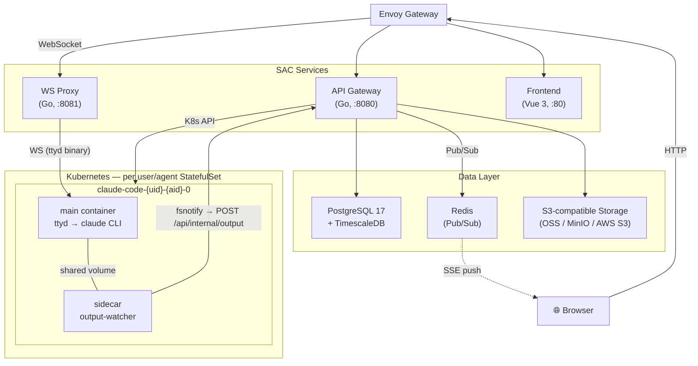
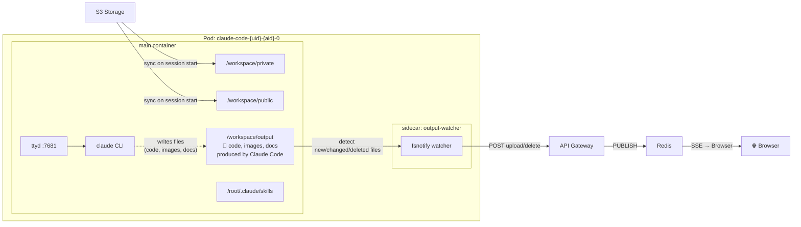

<p align="center">
  
</p>

<h1 align="center">SAC - Sandbox Agent Cluster</h1>

<p align="center">
  <a href="README.md">🇺🇸 English</a> •
  <a href="docs/i18n/README.zh.md">🇨🇳 中文</a>
</p>

SAC is an open-source platform that makes [Claude Code](https://docs.anthropic.com/en/docs/claude-code) accessible to everyone — not just developers. It runs each user's AI agent in an isolated Kubernetes environment, accessible through a simple web browser. Within your organization, team members can share and install expertly crafted skills, and collaboratively build a knowledge base that solves real-world problems.

## Why SAC?

Claude Code is a revolutionary AI agent that can do almost anything, but using it requires terminal proficiency and local setup. SAC removes these barriers entirely:

- **Zero-barrier access** — anyone in your org can use Claude Code through a web browser, no CLI experience needed
- **Skill sharing** — create reusable slash commands from your best ideas and share them across the team with one click
- **Collaborative knowledge base** — build a shared workspace of prompts, templates, and reference materials that makes every agent smarter
- **Multi-provider flexibility** — Anthropic, OpenRouter, GLM (ZhiPu AI), Qwen, Nebula, or any compatible API
- **Secure isolation** — each agent runs in its own K8s StatefulSet with dedicated resources, no interference between users

## Architecture





> **Output Workspace**: When Claude Code generates files — source code, images, documents, or any artifact — they land in `/workspace/output`. The sidecar (`output-watcher`) detects these file changes via fsnotify and uploads them to S3 storage through the internal API. The API then publishes an event to Redis, which pushes an SSE notification to the browser so the user sees new files appear in real time without polling.

## Features

### Agent Management
- Create up to N agents per user (configurable), each with independent LLM configuration
- Built-in presets for OpenRouter, GLM, Qwen, and custom providers
- Per-agent resource limits (CPU/memory), configurable by admin
- One-click pod restart, real-time status monitoring

### Web Terminal
- Full PTY access via [xterm.js](https://xtermjs.org/) with WebGL rendering
- Two interaction modes: **terminal** (raw keystrokes) and **chat** (message-based input)
- Binary WebSocket proxy with ttyd protocol translation
- Auto-reconnect, resize support, Unicode/CJK wide-character rendering

### Skill Marketplace
- Create, fork, and share reusable slash commands
- Parameterized skills with dynamic form inputs (text, number, date, select)
- 4-tier visibility: Official → Public → Group → Private
- Skills sync to pods as tar bundles in `/root/.claude/skills/` with checksum-based incremental sync
- One-click execution from the sidebar

### Workspace Files
- Per-agent private storage backed by S3-compatible storage (OSS, MinIO, AWS S3)
- Shared public workspace (admin-managed)
- Group workspace with per-group quotas
- Output workspace (Working tab) — sidecar-populated, real-time SSE push via Redis Pub/Sub
- Upload, download, create directories, delete
- In-browser preview: text (editable), images, binary info
- Quota enforcement (1GB / 1000 files per agent by default)
- Auto-sync to pod on session creation

### Conversation History
- Hook-based capture via `conversation-sync.mjs` running inside each pod
- Stored in TimescaleDB hypertable for efficient time-series queries
- Cursor-based pagination, session filtering, CSV export
- Admin can search and export across all users

### Admin Panel
- System-wide settings (agent limits, resource defaults)
- User management with role-based access (user/admin)
- Per-user setting overrides
- Agent lifecycle management (restart, delete, resource adjustment)
- Cross-user conversation search and export

## Tech Stack

| Layer | Technology |
|-------|-----------|
| Frontend | Vue 3, TypeScript, Naive UI, xterm.js, Pinia, Vite |
| Backend | Go, Gin, Bun ORM, gorilla/websocket, go-redis/v9 |
| Database | PostgreSQL 17 + TimescaleDB |
| Cache/PubSub | Redis (standalone, bitnami Helm subchart) |
| Storage | S3-compatible (Alibaba Cloud OSS, MinIO, AWS S3, etc.) |
| Container | Kubernetes, StatefulSet per agent (main + sidecar), ttyd |
| Ingress | Any ingress controller (optional Envoy Gateway subchart included) |
| Deploy | Helm 3, Docker multi-stage builds |

## Quick Start

### Prerequisites

- Kubernetes cluster
- PostgreSQL 17+ with TimescaleDB extension
- S3-compatible storage (Alibaba Cloud OSS, MinIO, AWS S3, etc.)
- Docker registry access
- Helm 3
- Any ingress controller that can route:
  - `/api/*` → `api-gateway:8080`
  - `/ws/*` → `ws-proxy:8081` (WebSocket)
  - `/*` → `frontend:80`
  - The Helm chart includes an optional [Envoy Gateway](https://gateway.envoyproxy.io/) subchart (`envoyGateway.enabled: true`), or bring your own Nginx / Traefik / Istio / etc.

### 1. Build Images

```bash
make docker-build    # builds all 5 images (auto-bumps version)
make docker-push     # pushes to registry
```

This builds:
- `api-gateway` — REST API server
- `ws-proxy` — WebSocket terminal proxy
- `frontend` — Vue 3 SPA served by nginx
- `cc` — Claude Code container with ttyd
- `output-watcher` — Sidecar that watches /workspace/output and syncs to OSS

### 2. Configure

Edit `helm/sac/values.yaml`:

```yaml
global:
  registry: your-registry.example.com/sac

database:
  host: your-postgres-host
  port: 5432
  user: sandbox
  password: your-password
  name: sandbox

auth:
  jwtSecret: your-jwt-secret

redis:
  enabled: true          # built-in Redis; set false to use external
  externalURL: ""        # redis://host:port (when enabled=false)

envoyGateway:
  host: sac.your-domain.com
```

Storage settings are configured at runtime via the admin panel (System Settings).

### 3. Deploy

```bash
# Update Helm dependencies (Redis subchart)
make helm-dep-update

# First install
make helm-deploy

# Or upgrade existing release
make helm-upgrade
```

### 4. Initialize Database

```bash
# Run migrations
make migrate-up

# Seed admin user (admin / admin123)
make migrate-seed
```

### 5. Access

Open `http://sac.your-domain.com` in your browser. Log in with `admin` / `admin123`, then:

1. Configure storage in Admin → System Settings
2. Create your first agent (configure LLM provider)
3. Start a session — a dedicated pod will be created
4. Use the terminal or chat mode to interact with Claude Code

## Local Development

SAC uses [Telepresence](https://www.telepresence.io/) to connect your local machine to the K8s cluster network, so local services can reach pod IPs directly.

```bash
# One command to start everything
make dev

# Or step by step:
make telepresence          # connect to K8s network
make build                 # compile Go binaries
make restart SVC=api       # restart API Gateway
make restart SVC=ws        # restart WS Proxy
make restart SVC=fe        # restart frontend dev server

# Utilities
make status                # show service status
make logs SVC=api          # tail API Gateway logs
make stop                  # stop all services
```

Services:
| Service | Port | Log |
|---------|------|-----|
| API Gateway | 8080 | `/tmp/sac-api-gateway.log` |
| WS Proxy | 8081 | `/tmp/sac-ws-proxy.log` |
| Frontend (Vite) | 5173 | `/tmp/sac-frontend.log` |

## Project Structure

```
sac/
├── backend/
│   ├── cmd/
│   │   ├── api-gateway/          # HTTP API server
│   │   ├── ws-proxy/             # WebSocket terminal proxy
│   │   ├── output-watcher/       # Sidecar: fsnotify → API upload
│   │   ├── maintenance/          # CronJob: skill sync, session/file cleanup
│   │   └── migrate/              # Database migration CLI
│   ├── internal/
│   │   ├── admin/                # Admin panel handlers + settings
│   │   ├── agent/                # Agent CRUD + K8s lifecycle
│   │   ├── auth/                 # JWT auth + bcrypt passwords
│   │   ├── container/            # K8s StatefulSet management + sidecar
│   │   ├── database/             # PostgreSQL connection (bun ORM)
│   │   ├── group/                # Group CRUD + membership
│   │   ├── history/              # Conversation history (TimescaleDB)
│   │   ├── models/               # Data models
│   │   ├── redis/                # Redis client singleton (Pub/Sub)
│   │   ├── session/              # Session lifecycle
│   │   ├── skill/                # Skill CRUD + versioning + pod sync
│   │   ├── storage/              # Pluggable S3-compatible backend
│   │   ├── websocket/            # ttyd WebSocket proxy
│   │   └── workspace/            # File ops, quota, output SSE watch
│   ├── migrations/               # 26 database migrations
│   └── pkg/
│       ├── config/               # Environment-based configuration
│       └── response/             # Standardized HTTP responses
├── frontend/
│   └── src/
│       ├── components/
│       │   ├── Terminal/         # xterm.js WebGL terminal
│       │   ├── ChatInput/        # Chat-mode input bar
│       │   ├── Agent/            # Agent selector + creator
│       │   ├── SkillPanel/       # Agent dashboard sidebar
│       │   ├── SkillMarketplace/ # Skill browse/create/fork
│       │   └── Workspace/        # File browser + preview + SSE watch
│       ├── services/             # API client layer
│       ├── stores/               # Pinia auth store
│       ├── views/                # Login, Register, Main, Admin
│       └── utils/                # Error handling, file types
├── docker/
│   ├── api-gateway/              # Go multi-stage Dockerfile
│   ├── ws-proxy/                 # Go multi-stage Dockerfile
│   ├── frontend/                 # Vue build + nginx
│   ├── claude-code/              # Ubuntu + ttyd + Claude Code CLI
│   └── output-watcher/           # Sidecar Dockerfile
├── helm/sac/                     # Helm chart
│   ├── templates/                # K8s manifests
│   ├── files/                    # Hook scripts + settings
│   └── charts/                   # Envoy Gateway + Redis subcharts
├── Makefile                      # Dev, build, deploy commands
└── .version                      # Current version
```

## API Overview

<details>
<summary>Public endpoints</summary>

```
POST /api/auth/register
POST /api/auth/login
GET  /health
```
</details>

<details>
<summary>Protected endpoints (JWT required)</summary>

```
# Auth
GET  /api/auth/me

# Agents
GET    /api/agents
POST   /api/agents
GET    /api/agents/:id
PUT    /api/agents/:id
DELETE /api/agents/:id
POST   /api/agents/:id/restart
POST   /api/agents/:id/skills
DELETE /api/agents/:id/skills/:skillId
POST   /api/agents/:id/sync-skills
GET    /api/agent-statuses

# Sessions
POST   /api/sessions
GET    /api/sessions
GET    /api/sessions/:sessionId
DELETE /api/sessions/:sessionId

# Skills
GET    /api/skills
POST   /api/skills
GET    /api/skills/:id
PUT    /api/skills/:id
DELETE /api/skills/:id
POST   /api/skills/:id/fork
GET    /api/skills/public

# Conversations
GET    /api/conversations
GET    /api/conversations/sessions
GET    /api/conversations/export

# Groups
GET    /api/groups
GET    /api/groups/:id
GET    /api/groups/:id/members

# Workspace (private)
GET    /api/workspace/status
POST   /api/workspace/upload
GET    /api/workspace/files
GET    /api/workspace/files/download
DELETE /api/workspace/files
POST   /api/workspace/directories
GET    /api/workspace/quota

# Workspace (public)
GET    /api/workspace/public/files
GET    /api/workspace/public/files/download
POST   /api/workspace/public/upload
POST   /api/workspace/public/directories
DELETE /api/workspace/public/files

# Workspace (group)
GET    /api/workspace/group/files
GET    /api/workspace/group/files/download
POST   /api/workspace/group/upload
POST   /api/workspace/group/directories
DELETE /api/workspace/group/files
GET    /api/workspace/group/quota

# Workspace (output — read-only + SSE)
GET    /api/workspace/output/files
GET    /api/workspace/output/files/download
GET    /api/workspace/output/watch          # SSE stream

# Workspace sync
POST   /api/workspace/sync
GET    /api/workspace/sync-stream           # SSE stream

# WebSocket
WS     /ws/:sessionId?token=<jwt>&agent_id=<id>
```
</details>

<details>
<summary>Admin endpoints (admin role required)</summary>

```
GET    /api/admin/settings
PUT    /api/admin/settings/:key
GET    /api/admin/users
PUT    /api/admin/users/:id/role
GET    /api/admin/users/:id/settings
PUT    /api/admin/users/:id/settings/:key
DELETE /api/admin/users/:id/settings/:key
GET    /api/admin/users/:id/agents
DELETE /api/admin/users/:id/agents/:agentId
POST   /api/admin/users/:id/agents/:agentId/restart
PUT    /api/admin/users/:id/agents/:agentId/resources
GET    /api/admin/conversations
GET    /api/admin/conversations/export

# Admin groups
GET    /api/admin/groups
POST   /api/admin/groups
PUT    /api/admin/groups/:id
DELETE /api/admin/groups/:id
GET    /api/admin/groups/:id/members
POST   /api/admin/groups/:id/members
DELETE /api/admin/groups/:id/members/:userId
PUT    /api/admin/groups/:id/members/:userId
```
</details>

## Configuration

All backend configuration is via environment variables (with `.env` file support):

| Variable | Default | Description |
|----------|---------|-------------|
| `API_GATEWAY_PORT` | `8080` | API server port |
| `WS_PROXY_PORT` | `8081` | WebSocket proxy port |
| `DB_HOST` | `localhost` | PostgreSQL host |
| `DB_PORT` | `5432` | PostgreSQL port |
| `DB_USER` | `sandbox` | Database user |
| `DB_PASSWORD` | — | Database password |
| `DB_NAME` | `sandbox` | Database name |
| `JWT_SECRET` | — | Secret for JWT signing (HS256) |
| `KUBECONFIG_PATH` | — | Path to kubeconfig (auto-detects in-cluster) |
| `K8S_NAMESPACE` | `sac` | Kubernetes namespace |
| `DOCKER_REGISTRY` | — | Container image registry |
| `DOCKER_IMAGE` | — | Claude Code container image |
| `SIDECAR_IMAGE` | — | Output watcher sidecar image |
| `REDIS_URL` | `redis://redis.sac:6379` | Redis URL for Pub/Sub (SSE push) |

## License

MIT
