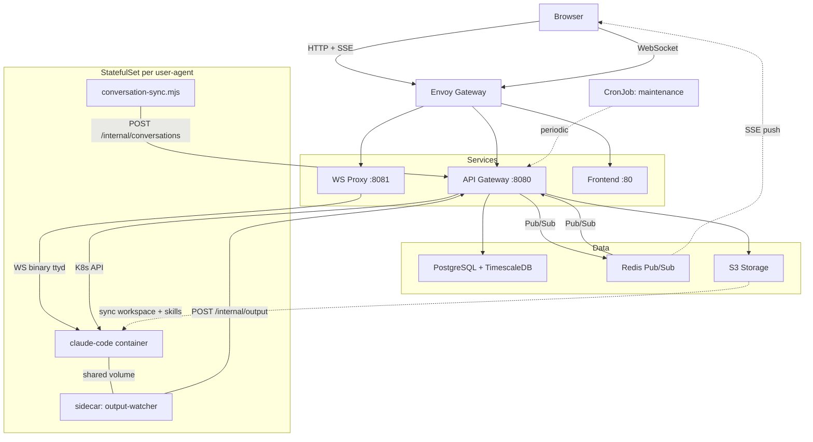
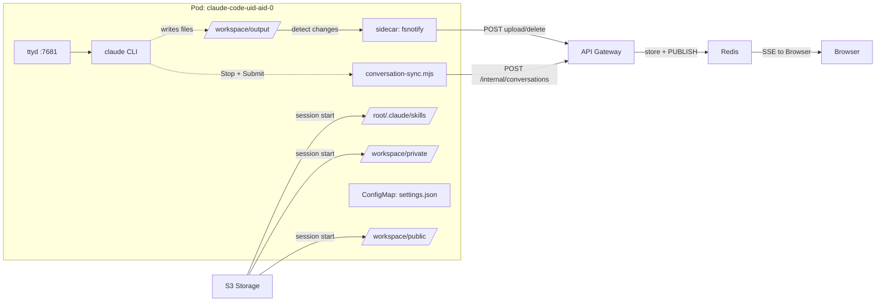

  

<h1 align="center">SAC - Sandbox Agent Cluster</h1>

  <a href="README.md">🇺🇸 English</a> •
  <a href="docs/i18n/README.zh.md">🇨🇳 中文</a>

SAC is an open-source platform that makes [Claude Code](https://docs.anthropic.com/en/docs/claude-code) accessible to everyone — not just developers. It runs each user's AI agent in an isolated Kubernetes environment, accessible through a simple web browser. Within your organization, team members can share and install expertly crafted skills, and collaboratively build a knowledge base that solves real-world problems.

## Why SAC?

Claude Code is a revolutionary AI agent that can do almost anything, but using it requires terminal proficiency and local setup. SAC removes these barriers entirely:

- **Zero-barrier access** — anyone in your org can use Claude Code through a web browser, no CLI experience needed
- **Skill sharing** — create reusable slash commands from your best ideas and share them across the team with one click
- **Collaborative knowledge base** — build a shared workspace of prompts, templates, and reference materials that makes every agent smarter
- **Multi-provider flexibility** — Anthropic, OpenRouter, GLM (ZhiPu AI), Qwen, Nebula, or any compatible API
- **Secure isolation** — each agent runs in its own K8s StatefulSet with dedicated resources, no interference between users

## Architecture

### System Overview

### Agent Pod Internals

> **How it works**: Each agent runs in a dedicated StatefulSet pod with two containers. The main container runs `claude CLI` behind `ttyd` (terminal over WebSocket) with `dtach` for session persistence. When Claude generates files in `/workspace/output`, the sidecar detects changes via fsnotify and uploads them to S3 through the internal API — Redis Pub/Sub then pushes SSE events to the browser for real-time updates. Conversation history is captured by a hook script (`conversation-sync.mjs`) that triggers on Stop/Submit events and incrementally syncs transcripts to TimescaleDB. Skills are synced to pods as tar bundles with checksum-based deduplication. A maintenance CronJob periodically syncs skills, cleans stale sessions, expired conversations, and orphaned files.

## Features

### Agent Management
- Create up to N agents per user (configurable), each with independent LLM configuration
- Built-in presets for OpenRouter, GLM, Qwen, and custom providers
- Per-agent resource limits (CPU/memory), configurable by admin
- One-click pod restart, real-time status monitoring

### Web Terminal
- Full PTY access via [xterm.js](https://xtermjs.org/) with WebGL rendering
- Two interaction modes: **terminal** (raw keystrokes) and **chat** (message-based input)
- Binary WebSocket proxy with ttyd protocol translation
- Auto-reconnect, resize support, Unicode/CJK wide-character rendering

### Skill Marketplace
- Create, fork, and share reusable slash commands
- Parameterized skills with dynamic form inputs (text, number, date, select)
- 4-tier visibility: Official → Public → Group → Private
- Skills sync to pods as tar bundles in `/root/.claude/skills/` with checksum-based incremental sync
- One-click execution from the sidebar

### Workspace Files
- Per-agent private storage backed by S3-compatible storage (OSS, MinIO, AWS S3)
- Shared public workspace (admin-managed)
- Group workspace with per-group quotas
- Output workspace (Working tab) — sidecar-populated, real-time SSE push via Redis Pub/Sub
- Upload, download, create directories, delete
- In-browser preview: text (editable), images, binary info
- Quota enforcement (1GB / 1000 files per agent by default)
- Auto-sync to pod on session creation

### Conversation History
- Hook-based capture via `conversation-sync.mjs` running inside each pod
- Stored in TimescaleDB hypertable for efficient time-series queries
- Cursor-based pagination, session filtering, CSV export
- Admin can search and export across all users

### Admin Panel
- System-wide settings (agent limits, resource defaults)
- User management with role-based access (user/admin)
- Per-user setting overrides
- Agent lifecycle management (restart, delete, resource adjustment)
- Cross-user conversation search and export

## Tech Stack

| Layer | Technology |
|-------|-----------|
| Frontend | Vue 3, TypeScript, Naive UI, xterm.js, Pinia, Vite |
| Backend | Go, Gin, Bun ORM, gorilla/websocket, go-redis/v9 |
| Database | PostgreSQL 17 + TimescaleDB |
| Cache/PubSub | Redis (standalone, bitnami Helm subchart) |
| Storage | S3-compatible (Alibaba Cloud OSS, MinIO, AWS S3, etc.) |
| Container | Kubernetes, StatefulSet per agent (main + sidecar), ttyd |
| Ingress | Any ingress controller (optional Envoy Gateway subchart included) |
| Deploy | Helm 3, Docker multi-stage builds |

## Quick Start

See the **[Guide](docs/guide.md)** for full setup instructions, local development, project structure, API reference, and configuration details.

## Roadmap

- [ ] Adopt a [JuiceFS](https://github.com/juicefs/juicefs)-like approach for more flexible and user-friendly file sharing and agent persistence
- [ ] Support agents beyond Claude Code (e.g. Codex, Gemini CLI, etc.)
- [ ] Messaging integrations (Slack, Discord, Feishu, etc.) for agent notifications and interaction
- [ ] Built-in MCP + Skill support for agents to deploy and manage CronJobs internally

## License

MIT
