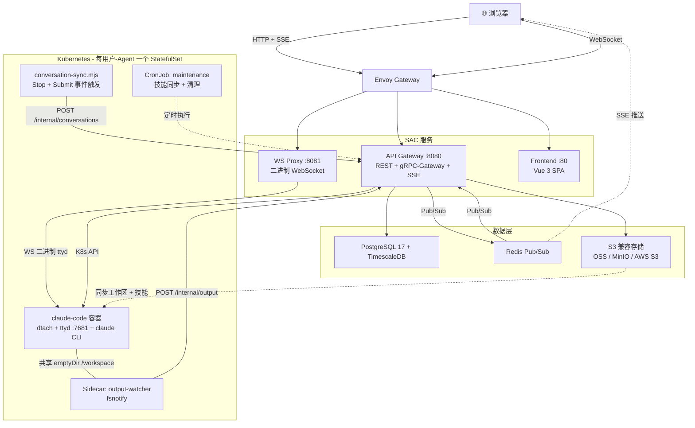
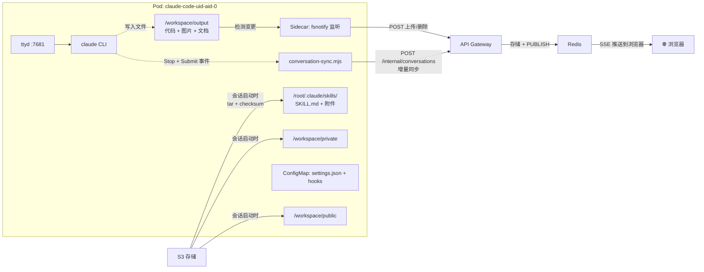

  

<h1 align="center">SAC - Sandbox Agent Cluster</h1>

  <a href="../../README.md">🇺🇸 English</a> •
  <a href="README.zh.md">🇨🇳 中文</a>

SAC 是一个开源平台，让 [Claude Code](https://docs.anthropic.com/en/docs/claude-code) 触手可及 —— 不仅仅面向开发者。它为每个用户在 Kubernetes 中运行独立的 AI Agent 环境，只需一个浏览器即可使用。在组织内部，团队成员可以高效分享和安装精心打造的技能，共同构建一个能解决各种实际问题的知识库。

## 为什么选择 SAC？

Claude Code 是一个革命性的 AI Agent，它几乎能做一切，但使用它需要终端操作经验和本地环境搭建。SAC 彻底消除了这些门槛：

- **零门槛使用** — 组织内任何人都可以通过浏览器使用 Claude Code，无需命令行经验
- **技能共享** — 将你精妙的想法创建为可复用的斜杠命令，一键分享给团队
- **协作知识库** — 构建共享的提示词、模板和参考资料工作区，让每个 Agent 都更智能
- **多供应商灵活切换** — Anthropic、OpenRouter、GLM（智谱 AI）、通义千问、Nebula，或任何兼容的 API
- **安全隔离** — 每个 Agent 运行在独立的 K8s StatefulSet 中，资源独享，互不干扰

## 架构

### 系统总览

### Agent Pod 内部结构

> **工作原理**：每个 Agent 运行在专属的 StatefulSet Pod 中，包含两个容器。主容器通过 `ttyd`（终端 WebSocket 化）运行 `claude CLI`，并使用 `dtach` 实现会话持久化。当 Claude 在 `/workspace/output` 中生成文件时，Sidecar 通过 fsnotify 检测变更并上传到 S3 — Redis Pub/Sub 随后将 SSE 事件推送到浏览器，实现实时更新。对话历史由 Hook 脚本（`conversation-sync.mjs`）在 Stop/Submit 事件触发时增量同步到 TimescaleDB。技能以 tar 包形式同步到 Pod，基于 checksum 去重。维护 CronJob 定期执行技能同步、过期会话清理、对话清理和孤儿文件清理。

## 功能特性

### Agent 管理
- 每个用户最多创建 N 个 Agent（可配置），各自拥有独立的 LLM 配置
- 内置 OpenRouter、GLM、通义千问和自定义提供商预设
- Agent 级资源限制（CPU/内存），管理员可配置
- 一键重启 Pod，实时状态监控

### Web 终端
- 通过 [xterm.js](https://xtermjs.org/) 实现完整的 PTY 访问，支持 WebGL 渲染
- 两种交互模式：**终端**（原始按键）和 **聊天**（消息输入）
- 二进制 WebSocket 代理，支持 ttyd 协议转换
- 自动重连、窗口调整、Unicode/CJK 宽字符渲染

### 技能市场
- 创建、Fork 和共享可复用的斜杠命令
- 支持参数化技能，动态表单输入（文本、数字、日期、下拉选择）
- 4 级可见性：官方 → 公开 → 团队 → 私有
- 技能以 tar 包同步到 Pod 的 `/root/.claude/skills/`，基于 checksum 增量同步
- 侧边栏一键执行

### 工作区文件
- 基于 S3 兼容存储的 Agent 级私有存储（阿里云 OSS、MinIO、AWS S3 等）
- 共享公共工作区（管理员管理）
- 团队工作区，支持按组配额
- Output 工作区（Working 标签）— Sidecar 填充，通过 Redis Pub/Sub 实时 SSE 推送
- 上传、下载、创建目录、删除
- 浏览器内预览：文本（可编辑）、图片、二进制信息
- 配额限制（默认每 Agent 1GB / 1000 个文件）
- 创建会话时自动同步到 Pod

### 对话历史
- 通过每个 Pod 内运行的 `conversation-sync.mjs` Hook 采集
- 存储在 TimescaleDB hypertable 中，高效时序查询
- 游标分页、会话过滤、CSV 导出
- 管理员可跨用户搜索和导出

### 管理面板
- 全局系统设置（Agent 限制、资源默认值）
- 用户管理，基于角色的访问控制（user/admin）
- 用户级设置覆盖
- Agent 生命周期管理（重启、删除、资源调整）
- 跨用户对话搜索和导出

## 技术栈

| 层级 | 技术 |
|------|------|
| 前端 | Vue 3, TypeScript, Naive UI, xterm.js, Pinia, Vite |
| 后端 | Go, Gin, Bun ORM, gorilla/websocket, go-redis/v9 |
| 数据库 | PostgreSQL 17 + TimescaleDB |
| 缓存/消息 | Redis（standalone，bitnami Helm 子 Chart） |
| 存储 | S3 兼容（阿里云 OSS、MinIO、AWS S3 等） |
| 容器 | Kubernetes, 每 Agent 一个 StatefulSet（主容器 + Sidecar）, ttyd |
| 入口网关 | 任意 Ingress 控制器（可选内置 Envoy Gateway 子 Chart） |
| 部署 | Helm 3, Docker 多阶段构建 |

## 快速开始

完整的部署指南、本地开发、项目结构、API 参考和配置详情请参阅 **[使用指南](../guide.md)**。

## 路线图

- [ ] 参考 [JuiceFS](https://github.com/juicefs/juicefs) 等方案，实现更灵活友好的文件共享与 Agent 持久化
- [ ] 支持 Claude Code 以外的其他 Agent（如 Codex、Gemini CLI 等）
- [ ] 为 Agent 配置 Slack、Discord、飞书等通讯软件集成，实现消息通知与交互
- [ ] 提供内置 MCP + Skill，支持 Agent 在内部部署和管理 CronJob 等定时任务

## 开源协议

MIT
